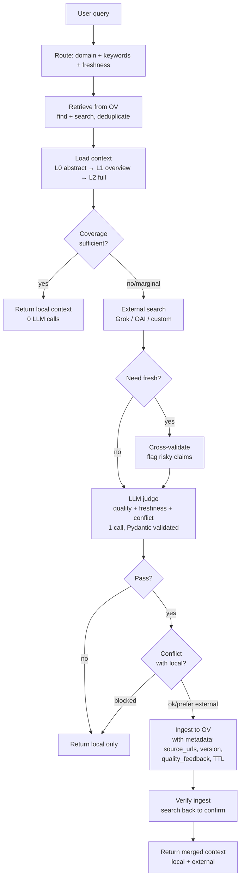

# OpenViking Curator

English / [中文](README_CN.md)

**Knowledge governance plugin for [OpenViking](https://github.com/volcengine/OpenViking).** Curator sits on top of your OV knowledge base — it decides when local knowledge is enough, when to search externally, reviews what comes back, and ingests the good stuff. Your knowledge base grows with every question.

[](LICENSE)
[](https://python.org)

## How it works



## What Curator actually does

Curator is the **governance layer** — it makes decisions about what goes in and out of your knowledge base. Here's what each part does:

| What | How | File |
|------|-----|------|
| **Route queries** | Rule-based: detect domain (tech/general), extract keywords, flag if fresh info needed. No LLM. | `router.py` |
| **Retrieve from OV** | Dual-path: `find` (vector) + `search` (LLM intent). Merges and deduplicates results by URI. | `retrieval_v2.py` |
| **Load on demand** | L0 (abstract ~100 tokens) → L1 (overview ~2k) → L2 (full text). Only goes deeper when shallower levels aren't enough. Saves tokens. | `retrieval_v2.py` |
| **Assess coverage** | Looks at OV scores: top score > 0.55 + multiple hits = sufficient. Otherwise triggers external search. | `retrieval_v2.py` |
| **External search** | Pluggable providers. Default: Grok (real-time web). Also supports any OAI-compatible model. | `search.py` + `search_providers.py` |
| **Cross-validate** | Only runs when `need_fresh=true`. LLM flags risky/outdated claims in external results. | `search.py` |
| **Judge + conflict detect** | Single LLM call: scores trust (0-10), freshness, decides pass/fail, and detects contradictions with local knowledge. Output validated by Pydantic. | `review.py` |
| **Conflict resolution** | Configurable strategy: `auto` (trust+freshness based), `local`, `external`, or `human` review. Conflicts can block ingest. | `pipeline_v2.py` |
| **Ingest** | Writes reviewed content back to OV with metadata: `source_urls`, `version`, `quality_feedback`, `freshness`, `ttl_days`, `review_after`. Also keeps local backup in `curated/`. | `review.py` |
| **Verify ingest** | After ingesting, searches OV again to confirm the new content is retrievable. | `pipeline_v2.py` |
| **Scan duplicates** | Compares resource titles by similarity (SequenceMatcher). Reports potential duplicates — does NOT auto-delete. | `dedup.py` |
| **Score freshness** | Extracts timestamp from OV URIs, calculates decay score (fresh → stale over time). | `freshness.py` |
| **Track sessions** | Records which queries were asked, which URIs were used. Commits session to extract long-term memories. | `session_manager.py` |
| **Log queries** | Every query → `data/query_log.jsonl` with coverage, external trigger reason, LLM call count. | `pipeline_v2.py` |
| **Analyze weak topics** | Clusters query logs to find topics that keep triggering external search = knowledge gaps. | `scripts/analyze_weak.py` |
| **Strengthen weak topics** | Runs pipeline on top N weak topics to proactively fill gaps. | `scripts/strengthen.py` |
| **Scan freshness** | Checks URL reachability + TTL expiry across all resources. `--act` to auto-refresh stale content. | `scripts/freshness_scan.py` |

### What Curator does NOT do

- **Vector search / indexing** → OV (or your backend) handles this
- **Answer generation** → your LLM does this; Curator returns structured context, not answers

## Quick Start

### Prerequisites

- Python 3.10+
- An OpenViking `ov.conf` with embedding + VLM endpoints ([docs](https://github.com/volcengine/OpenViking))
- API key for external search (Grok recommended) and LLM review

### Install

```bash
git clone https://github.com/ponsde/OpenViking_Curator.git
cd OpenViking_Curator
python3 -m venv .venv && source .venv/bin/activate
pip install -r requirements.txt

cp ov.conf.example ov.conf   # Fill your embedding + VLM endpoints
cp .env.example .env         # Fill API keys
```

### Run

```bash
# Health check
python3 curator_query.py --status

# Query (auto-ingest if external search finds good content)
python3 curator_query.py "How to deploy Redis in Docker?"

# Review mode (don't auto-ingest, human decides)
python3 curator_query.py --review "sensitive topic"
```

### Docker

```bash
cp ov.conf.example ov.conf && cp .env.example .env
docker compose build
docker compose run --rm curator curator_query.py --status
docker compose run --rm curator curator_query.py "your question"
```

### MCP Server

```bash
python3 mcp_server.py   # stdio JSON-RPC, works with Claude Desktop / mcporter / any MCP client
```

Tools: `curator_query`, `curator_ingest`, `curator_status`

### Python API

```python
from curator.pipeline_v2 import run

result = run("How to set up Nginx reverse proxy with SSL?")
print(result["context_text"])         # local context
print(result["external_text"])        # external supplement (if any)
print(result["coverage"])             # 0.0 ~ 1.0
print(result["meta"]["ingested"])     # True if new knowledge was stored
print(result["conflict"])             # conflict detection result
```

## Output

```json
{
  "query": "...",
  "context_text": "local OV results (L0/L1/L2 loaded)",
  "external_text": "external search results (if triggered)",
  "coverage": 0.68,
  "conflict": {
    "has_conflict": false,
    "summary": "",
    "points": [],
    "resolution": {"strategy": "auto", "preferred": "none"}
  },
  "meta": {
    "coverage": 0.68,
    "external_triggered": true,
    "external_reason": "low_coverage",
    "has_conflict": false,
    "ingested": true,
    "used_uris": ["viking://resources/..."],
    "decision_trace": {"load_stage": "L1", "llm_calls": 1}
  }
}
```

## Configuration

All via `.env` (git-ignored):

### Required

| Variable | Description |
|----------|-------------|
| `OPENVIKING_CONFIG_FILE` | Path to your `ov.conf` |
| `CURATOR_OAI_BASE` | OpenAI-compatible API base URL (for LLM review + routing) |
| `CURATOR_OAI_KEY` | API key |
| `CURATOR_GROK_KEY` | Grok API key (required if using Grok search, which is the default) |

### Optional

| Variable | Default | Description |
|----------|---------|-------------|
| `OV_DATA_PATH` | `./data` | OV data directory |
| `OV_BASE_URL` | _(empty)_ | Set to connect to remote OV HTTP serve instead of embedded mode |
| `CURATOR_GROK_BASE` | `http://127.0.0.1:8000/v1` | Grok endpoint |
| `CURATOR_GROK_MODEL` | `grok-4-fast` | Grok model |
| `CURATOR_SEARCH_PROVIDER` | `grok` | Search provider: `grok` / `oai` / custom |
| `CURATOR_LLM_ROUTE` | `1` | `1` = LLM routing, `0` = rule-only |
| `CURATOR_VERSION` | `0.7.0` | Version tag written into ingest metadata |
| `CURATOR_CHAT_RETRY_MAX` | `3` | Chat API retry attempts (transient errors only) |
| `CURATOR_CHAT_RETRY_BACKOFF_SEC` | `0.6` | Retry backoff base (seconds) |
| `CURATOR_CAPTURE_CASE` | `1` | Save pipeline cases for debugging |
| `CURATOR_CONFLICT_STRATEGY` | `auto` | `auto` / `local` / `external` / `human` |

### Coverage thresholds

| Variable | Default | Effect |
|----------|---------|--------|
| `CURATOR_THRESHOLD_COV_SUFFICIENT` | `0.55` | Above = skip external search |
| `CURATOR_THRESHOLD_COV_MARGINAL` | `0.45` | Above = marginal (still searches) |
| `CURATOR_THRESHOLD_COV_LOW` | `0.35` | Below = definitely search |
| `CURATOR_THRESHOLD_L0_SUFFICIENT` | `0.62` | L0 score threshold to skip L1 |
| `CURATOR_THRESHOLD_L1_SUFFICIENT` | `0.50` | L1 score threshold to skip L2 |

### Conflict resolution strategies

| Strategy | Behavior |
|----------|----------|
| `auto` (default) | Trust ≥ 7 + current → prefer external. Trust ≤ 3 → prefer local. Otherwise → human review. |
| `local` | Always prefer local knowledge |
| `external` | Always prefer external source |
| `human` | Always flag for human review |

## Ingest metadata

Every ingested document carries traceable metadata:

| Field | Example | Purpose |
|-------|---------|---------|
| `freshness` | `current` | `current` / `recent` / `unknown` / `outdated` |
| `ttl_days` | `180` | Time-to-live based on freshness |
| `ingested` | `2026-02-22` | Ingest date |
| `review_after` | `2026-08-21` | When to re-check |
| `version` | `0.7.0` | Curator version that ingested this |
| `source_urls` | `["https://..."]` | Deduplicated source URLs from external text |
| `quality_feedback` | `{"judge_trust": 8, ...}` | Judge signals for future quality loops |

## Maintenance scripts

```bash
# Find weak topics (knowledge gaps)
python3 scripts/analyze_weak.py --top 10

# Proactively fill gaps
python3 scripts/strengthen.py --top 5

# Scan freshness (URL reachability + TTL expiry)
python3 scripts/freshness_scan.py --limit 50
python3 scripts/freshness_scan.py --ttl-scan          # Check TTL metadata
python3 scripts/freshness_scan.py --ttl-scan --act     # Auto-refresh expired
```

## Project structure

```
curator/
  backend.py           # KnowledgeBackend abstract interface
  backend_ov.py        # OpenViking implementation (embedded + HTTP)
  backend_memory.py    # In-memory backend (for testing)
  pipeline_v2.py       # Main 4-step pipeline
  session_manager.py   # Dual-mode OV client (embedded / HTTP)
  retrieval_v2.py      # L0→L1→L2 loading + coverage + dedup
  search.py            # External search + cross-validation
  review.py            # LLM review + Pydantic validation + ingest + conflict
  router.py            # Rule-based query routing
  config.py            # All config + chat with retry
  freshness.py         # URI time-decay scoring
  dedup.py             # Duplicate resource scanning
  legacy/              # Archived v1 modules
curator_query.py       # CLI entry point
mcp_server.py          # MCP server (stdio JSON-RPC)
search_providers.py    # Pluggable search provider registry
scripts/               # Maintenance: weak topics, strengthen, freshness scan
tests/                 # Unit tests
```

## Testing

```bash
python -m pytest tests/ -v
```

## Roadmap

- [x] KnowledgeBackend abstraction (pluggable storage)
- [x] Conflict detection + configurable resolution
- [x] Review mode (`--review`)
- [x] Ingest metadata (source_urls, version, quality_feedback)
- [x] Chat retry with backoff (transient errors only)
- [x] Pydantic-validated judge output
- [x] Weak topic analysis + proactive strengthening
- [x] Freshness scanning + TTL management
- [ ] Quality feedback loop (feedback → retrieval ranking)
- [ ] More search providers (DuckDuckGo, Tavily)
- [ ] Coverage auto-tuning (dynamic thresholds from hit rate)
- [ ] Example backends (Chroma, pgvector)

## License

[MIT](LICENSE)
