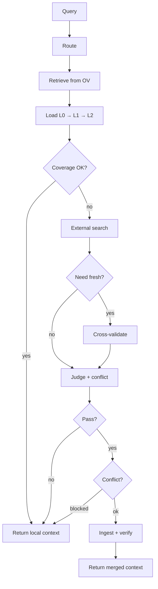

# OpenViking Curator

English / [中文](README_CN.md)

**Knowledge governance plugin for [OpenViking](https://github.com/volcengine/OpenViking).** Curator sits on top of your OV knowledge base — it decides when local knowledge is enough, when to search externally, reviews what comes back, and ingests the good stuff. Your knowledge base grows with every question.

[](https://github.com/ponsde/OpenViking_Curator/actions)
[](LICENSE)
[](https://python.org)

## How it works


```mermaid
flowchart TD
    Q[Query] --> R[Route]
    R --> OV[Retrieve from OV]
    OV --> L[Load L0 → L1 → L2]
    L --> COV{Coverage OK?}
    COV -- yes --> OUT1[Return local context]
    COV -- no --> EXT[External search]
    EXT --> F{Need fresh?}
    F -- yes --> CV[Cross-validate]
    F -- no --> J
    CV --> J[Judge + conflict]
    J --> P{Pass?}
    P -- no --> OUT1
    P -- yes --> C{Conflict?}
    C -- blocked --> OUT1
    C -- ok --> ING[Ingest + verify]
    ING --> OUT2[Return merged context]
```

**LLM call strategy:**
- Coverage sufficient → **0 LLM calls**, return immediately
- External search triggered → **1 LLM call** (judge + conflict combined)
- Need freshness validation → **2 LLM calls** (+ cross-validate)

## Features

| Feature | Description | Module |
|---------|-------------|--------|
| **Rule-based routing** | Domain, keywords, freshness detection. No LLM needed. JSON-configurable. | `router.py` |
| **Dual-path retrieval** | `find` (vector) + `search` (LLM intent). URI dedup. | `retrieval_v2.py` |
| **On-demand loading** | L0 (abstract) → L1 (overview) → L2 (full). Only deeper when needed. | `retrieval_v2.py` |
| **Coverage assessment** | Score gap + keyword overlap signals. 0 LLM calls. | `retrieval_v2.py` |
| **External search** | Pluggable providers: Grok, DuckDuckGo, Tavily. Fallback chain or concurrent. | `search_providers.py` |
| **Domain filtering** | Whitelist / blacklist external search results by domain. | `domain_filter.py` |
| **Cross-validation** | When `need_fresh=true`. Flags risky/outdated claims. | `search.py` |
| **Judge + conflict** | Single LLM call: trust 0-10, freshness, pass/fail, contradiction. Pydantic validated. | `review.py` |
| **Conflict resolution** | Configurable: `auto` / `local` / `external` / `human`. Bidirectional scoring. | `pipeline_v2.py` |
| **Ingest** | Writes to OV with metadata (source URLs, version, TTL, quality feedback). | `review.py` |
| **Async ingest** | Fire-and-forget background thread. Observable via async job tracker. | `pipeline_v2.py` + `async_jobs.py` |
| **Auto-summarize** | Generates L0/L1 summaries on ingest for new resources. | `pipeline_v2.py` |
| **Dedup scanning** | URL hash (exact match) + Jaccard word similarity. Reports only. | `dedup.py` |
| **Freshness scoring** | URI timestamp → decay score. Configurable thresholds. | `freshness.py` |
| **Usage-based TTL** | Hot / warm / cold tiers. Frequently used → longer TTL. | `usage_ttl.py` |
| **Feedback reranking** | `up`/`down`/`adopt` per URI. Score-weighted, rank-aware. OV score stays dominant. | `feedback_store.py` |
| **Decision report** | ASCII box, single-line, JSON, HTML export. Always present in `run()` output. | `decision_report.py` |
| **Session tracking** | Records queries + used URIs. Commits to extract long-term memory. | `session_manager.py` |
| **Query logging** | Every query → `query_log.jsonl` with coverage, reasons, LLM calls. | `pipeline_v2.py` |
| **Circuit breaker** | 3-state breaker wrapping LLM + search calls. Auto-recovery. | `circuit_breaker.py` |
| **Search cache** | LRU + dual TTL. File-locked JSON persistence. | `search_cache.py` |
| **Automated governance** | Weekly cycle: audit, flag, proactive search, report. Hybrid async. No auto-deletion. | `governance.py` |
| **Interest analysis** | Extract user interests from query log + feedback. Generate proactive search queries. | `interest_analyzer.py` |
| **Background scheduler** | APScheduler: periodic freshness scan + weak topic strengthening + governance. | `scheduler.py` |
| **Structured logging** | structlog with JSON mode. Per-run context binding (run_id, query). | `logging_setup.py` |

### What Curator does NOT do

- **Vector search / indexing** → OpenViking handles this
- **Answer generation** → your LLM; Curator returns structured context, not answers

## Quick Start

### Prerequisites

- Python 3.10+
- A working [OpenViking](https://github.com/volcengine/OpenViking) setup (embedded or HTTP mode)
- An OpenAI-compatible API endpoint (for LLM review)
- A search API (Grok recommended, or DuckDuckGo/Tavily)

### Install

```bash
git clone https://github.com/ponsde/OpenViking_Curator.git
cd OpenViking_Curator

# Recommended: uv (fast, reproducible)
uv sync
source .venv/bin/activate

# Alternative: pip
python3 -m venv .venv && source .venv/bin/activate
pip install -r requirements.txt

cp .env.example .env   # then fill in your keys
```

### Configure

Edit `.env`:

```bash
# OpenViking config (embedded mode)
OPENVIKING_CONFIG_FILE=/path/to/your/ov.conf

# LLM for review & routing (any OpenAI-compatible endpoint)
CURATOR_OAI_BASE=https://your-llm-api.com/v1
CURATOR_OAI_KEY=sk-your-key

# External search (Grok recommended)
CURATOR_GROK_BASE=https://your-grok-endpoint/v1
CURATOR_GROK_KEY=your-grok-key
```

Three endpoints, three keys. That's it.

### Run

```bash
python3 curator_query.py --status                         # Health check
python3 curator_query.py "How to deploy Redis in Docker?" # Query
python3 curator_query.py --review "sensitive topic"       # Review mode (no auto-ingest)
python3 mcp_server.py                                     # MCP server (stdio JSON-RPC)
```

### Docker

```bash
# Embedded mode: OV runs in-process
cp ov.conf.example ov.conf   # fill in your embedding API keys
cp .env.example .env         # fill in LLM + search keys
docker compose build
docker compose run --rm curator curator_query.py --status
docker compose run --rm curator curator_query.py "your question"

# HTTP mode: OV runs as a separate service
cp ov.conf.example ov.conf   # keep as-is (not read in HTTP mode)
echo "OV_BASE_URL=http://your-ov-host:8080" >> .env
docker compose build
docker compose run --rm curator curator_query.py --status
```

### Python API

```python
from curator.pipeline_v2 import run

result = run("Nginx reverse proxy with SSL?")
print(result["context_text"])         # local context
print(result["external_text"])        # external (if any)
print(result["coverage"])             # 0.0 ~ 1.0
print(result["meta"]["ingested"])     # True if new content stored
print(result["conflict"])             # conflict detection
print(result["decision_report"])      # ASCII decision report

# Reusable pipeline instance (shares session + backend)
from curator.pipeline_v2 import CuratorPipeline
pipeline = CuratorPipeline()
r1 = pipeline.run("how to deploy?")
r2 = pipeline.run("what is RAG?")

# Decision report in other formats
from curator.decision_report import format_report_json, format_report_html
print(format_report_json(result))
print(format_report_html(result))

# Feedback (boosts retrieval ranking next time)
from curator.feedback_store import apply
apply("viking://resources/doc-id", "up")    # mark helpful
apply("viking://resources/doc-id", "down")  # mark unhelpful
```

## Configuration

All via `.env` (git-ignored). See `.env.example` for a full template.

### Core (required)

| Variable | Description |
|----------|-------------|
| `OPENVIKING_CONFIG_FILE` | Path to `ov.conf` (embedded mode) |
| `CURATOR_OAI_BASE` | OpenAI-compatible API base URL |
| `CURATOR_OAI_KEY` | API key for above |
| `CURATOR_GROK_KEY` | Grok API key (external search) |

### OV mode

| Variable | Default | Description |
|----------|---------|-------------|
| `OV_BASE_URL` | _(empty)_ | Set to use HTTP mode. Empty = embedded mode. |
| `OV_DATA_PATH` | `./data` | OV data directory (embedded mode) |

### Search

| Variable | Default | Description |
|----------|---------|-------------|
| `CURATOR_SEARCH_PROVIDERS` | `grok` | Comma-separated: `grok,duckduckgo,tavily` (fallback chain) |
| `CURATOR_SEARCH_CONCURRENT` | `0` | `1` = fire all providers in parallel |
| `CURATOR_SEARCH_TIMEOUT` | `60` | Global search timeout (seconds) |
| `CURATOR_TAVILY_KEY` | _(empty)_ | Tavily API key (if using tavily provider) |
| `CURATOR_ALLOWED_DOMAINS` | _(empty)_ | Whitelist (comma-separated) |
| `CURATOR_BLOCKED_DOMAINS` | _(empty)_ | Blacklist (comma-separated) |

### Thresholds

| Variable | Default | Effect |
|----------|---------|--------|
| `CURATOR_THRESHOLD_COV_SUFFICIENT` | `0.55` | Above = skip external search |
| `CURATOR_THRESHOLD_COV_MARGINAL` | `0.45` | Above = marginal (still searches) |
| `CURATOR_THRESHOLD_COV_LOW` | `0.35` | Below = definitely search |
| `CURATOR_THRESHOLD_L0_SUFFICIENT` | `0.62` | L0 score to skip L1 |
| `CURATOR_THRESHOLD_L1_SUFFICIENT` | `0.50` | L1 score to skip L2 |
| `CURATOR_MAX_L2_DEPTH` | `2` | Max full-text reads per run |

### Background scheduler

| Variable | Default | Description |
|----------|---------|-------------|
| `CURATOR_SCHEDULER_ENABLED` | `0` | `1` to activate background jobs |
| `CURATOR_FRESHNESS_INTERVAL_HOURS` | `24` | Freshness scan interval |
| `CURATOR_STRENGTHEN_INTERVAL_HOURS` | `168` | Weak topic strengthening interval (7 days) |
| `CURATOR_STRENGTHEN_TOP_N` | `3` | Number of weak topics per run |

### Governance

| Variable | Default | Description |
|----------|---------|-------------|
| `CURATOR_GOVERNANCE_ENABLED` | `0` | `1` to enable governance cycle |
| `CURATOR_GOVERNANCE_INTERVAL_HOURS` | `168` | Cycle interval (default 7 days) |
| `CURATOR_GOVERNANCE_MODE` | `normal` | `normal` or `team` (team adds full audit trail) |
| `CURATOR_GOVERNANCE_MAX_PROACTIVE` | `5` | Max proactive search queries per cycle |
| `CURATOR_GOVERNANCE_SYNC_BUDGET` | `0` | Sync queries before async (0 = fully async) |
| `CURATOR_GOVERNANCE_LOOKBACK_DAYS` | `30` | Query log analysis window |
| `CURATOR_GOVERNANCE_DRY_RUN` | `0` | `1` to skip writes (audit only) |
| `CURATOR_GOVERNANCE_REPLACES_STRENGTHEN` | `0` | `1` to skip standalone strengthen when governance is on |

### Other

| Variable | Default | Description |
|----------|---------|-------------|
| `CURATOR_ASYNC_INGEST` | `0` | `1` = fire-and-forget background ingest |
| `CURATOR_CONFLICT_STRATEGY` | `auto` | `auto` / `local` / `external` / `human` |
| `CURATOR_CB_ENABLED` | `1` | Circuit breaker (`0` to disable) |
| `CURATOR_CACHE_ENABLED` | `0` | Search result cache |
| `CURATOR_FEEDBACK_WEIGHT` | `0.10` | Feedback score adjustment (max delta) |
| `CURATOR_JSON_LOGGING` | `0` | `1` = JSON structured log output |
| `CURATOR_CHAT_RETRY_MAX` | `3` | LLM retry attempts |

## Maintenance

```bash
# Weak topic analysis
python3 scripts/analyze_weak.py --top 10

# Proactive strengthening
python3 scripts/strengthen.py --top 5

# Freshness scan
python3 scripts/freshness_scan.py --limit 50       # URL reachability
python3 scripts/freshness_scan.py --act             # Auto-refresh stale

# TTL rebalance
python3 scripts/ttl_rebalance.py                    # Report
python3 scripts/ttl_rebalance.py --json             # JSON export

# Async job management
python3 scripts/async_job_cli.py list               # Overview
python3 scripts/async_job_cli.py list --failed      # Failed jobs
python3 scripts/async_job_cli.py replay <job_id>    # Re-queue a job

# Governance (automated knowledge maintenance)
python3 -m curator.governance_cli report             # View latest report
python3 -m curator.governance_cli report --format json
python3 -m curator.governance_cli report --format html > report.html
python3 -m curator.governance_cli flags              # Pending flags
python3 -m curator.governance_cli flags --all        # All flags
python3 -m curator.governance_cli show <flag_id>     # Flag details
python3 -m curator.governance_cli keep <flag_id>     # Mark: keep resource
python3 -m curator.governance_cli delete <flag_id>   # Mark: approve deletion
python3 -m curator.governance_cli adjust <flag_id>   # Mark: needs adjustment
python3 -m curator.governance_cli ignore <flag_id>   # Mark: ignore this flag
python3 -m curator.governance_cli run                # Trigger full cycle
python3 -m curator.governance_cli run --dry          # Dry run (no writes)
python3 -m curator.governance_cli run --mode team    # Team mode (full audit)
```

Or enable the background scheduler (`CURATOR_SCHEDULER_ENABLED=1`) to run freshness scans and strengthening automatically. Add `CURATOR_GOVERNANCE_ENABLED=1` for automated governance cycles.

## Project structure

```
curator/
  pipeline_v2.py       # Main pipeline orchestrator
  config.py            # Config + HTTP client with retry
  settings.py          # Pydantic Settings v2 (typed, validated)
  backend.py           # KnowledgeBackend ABC
  backend_ov.py        # OpenViking backend (embedded + HTTP)
  backend_memory.py    # In-memory backend (testing)
  session_manager.py   # Dual-mode OV client
  retrieval_v2.py      # L0→L1→L2 retrieval + coverage
  search.py            # External search + cross-validation
  search_providers.py  # Pluggable provider registry
  review.py            # LLM judge + ingest + conflict
  router.py            # Rule-based routing (JSON config)
  freshness.py         # URI time-decay scoring
  usage_ttl.py         # Usage-based TTL tiers
  dedup.py             # Duplicate scanning
  decision_report.py   # ASCII / JSON / HTML reports
  feedback_store.py    # Up/down/adopt feedback
  domain_filter.py     # Domain whitelist/blacklist
  circuit_breaker.py   # 3-state circuit breaker
  search_cache.py      # LRU + dual-TTL cache
  async_jobs.py        # Background job tracking
  governance.py        # Automated governance cycle (6 phases)
  governance_cli.py    # Governance CLI (report, flags, run)
  governance_report.py # Governance report (ASCII/JSON/HTML)
  interest_analyzer.py # User interest extraction + proactive queries
  nlp_utils.py         # Topic extraction + keyword utils
  scheduler.py         # APScheduler periodic jobs
  logging_setup.py     # structlog configuration
  file_lock.py         # Shared flock utilities
  legacy/              # Archived v1
curator_query.py       # CLI entry point
mcp_server.py          # MCP server (stdio JSON-RPC)
scripts/               # Maintenance scripts
tests/                 # 554 tests
```

## Testing

```bash
# All tests (uses InMemoryBackend, no OV dependency)
uv run pytest tests/ -v

# Single file
uv run pytest tests/test_core.py -v

# Type checking
uv run mypy curator/ --ignore-missing-imports --exclude curator/legacy/
```

## Troubleshooting

| Problem | Cause | Fix |
|---------|-------|-----|
| `Missing required env vars` | `.env` not configured | Fill in `CURATOR_OAI_BASE`, `CURATOR_OAI_KEY`, `CURATOR_GROK_KEY` |
| `OV not available` | OpenViking not reachable | Check `OPENVIKING_CONFIG_FILE` (embedded) or `OV_BASE_URL` (HTTP) |
| `401 Unauthorized` | Wrong API key | Check keys in `.env` |
| Timeout on search | Endpoint unreachable | Check URL and service status |
| Coverage always 0.0 | OV is empty | Ingest some content first, or lower `CURATOR_THRESHOLD_COV_SUFFICIENT` |
| External always triggered | Thresholds too high | Lower coverage thresholds in `.env` |
| Judge returns low trust | Weak LLM model | Try a stronger model in `CURATOR_JUDGE_MODELS` |

## Roadmap

- [x] KnowledgeBackend abstraction (OV-agnostic interface)
- [x] Conflict detection + bidirectional resolution
- [x] Pydantic-validated judge output
- [x] Quality feedback loop (feedback → retrieval ranking)
- [x] Enhanced dedup (URL hash + Jaccard)
- [x] Decision report (ASCII + JSON + HTML)
- [x] Async ingest with job tracking + recovery CLI
- [x] Auto-generate L0/L1 summaries on ingest
- [x] Multi-provider search (Grok + DuckDuckGo + Tavily)
- [x] Domain filtering (whitelist / blacklist)
- [x] Usage-based TTL (hot / warm / cold tiers)
- [x] Circuit breaker + search cache
- [x] Structured logging (structlog + JSON mode)
- [x] Background scheduler (freshness + strengthen)
- [x] Docker support (embedded + HTTP OV modes)
- [x] mypy + pre-commit (ruff + ruff-format)
- [x] uv dependency management
- [x] Automated governance (audit, flag, proactive search, report)
- [x] Interest-based proactive search (query log + feedback analysis)
- [x] Hybrid async governance (sync budget + background thread + trace harvest)
- [ ] Coverage auto-tuning (dynamic thresholds from query log)
- [ ] Second backend implementation (beyond OpenViking)

## License

[MIT](LICENSE)
