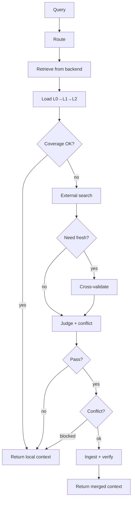

# OpenViking Curator

English / [中文](README_CN.md)

**Knowledge governance plugin for [OpenViking](https://github.com/volcengine/OpenViking).** Curator sits on top of your knowledge base — it decides when local knowledge is enough, when to search externally, reviews what comes back, and ingests the good stuff. Your knowledge base grows with every question.

[](LICENSE)
[](https://python.org)

## How it works



**LLM call strategy:**
- Coverage sufficient → **0 LLM calls**, return immediately
- External search triggered → **1 LLM call** (judge + conflict combined)
- Need freshness validation → **2 LLM calls** (+ cross-validate)

## What Curator does

Curator is the **governance layer** — it decides what goes in and out of your knowledge base.

| What | How | File |
|------|-----|------|
| **Route** | Rule-based: domain, keywords, freshness detection. No LLM. | `router.py` |
| **Retrieve** | Dual-path: `find` (vector) + `search` (LLM intent). Deduplicates by URI. | `retrieval_v2.py` |
| **Load on demand** | L0 (abstract) → L1 (overview) → L2 (full). Only goes deeper when needed. Saves tokens. | `retrieval_v2.py` |
| **Assess coverage** | Backend scores: top > 0.55 + multiple hits = sufficient. Otherwise → external search. | `retrieval_v2.py` |
| **External search** | Pluggable providers. Default: Grok (recommended for real-time web search). Any OAI-compatible endpoint works. | `search.py` + `search_providers.py` |
| **Cross-validate** | Only when `need_fresh=true`. Flags risky/outdated claims. | `search.py` |
| **Judge + conflict** | Single LLM call: trust score 0-10, freshness, pass/fail, contradiction detection. Pydantic validated. | `review.py` |
| **Conflict resolution** | Configurable: `auto` / `local` / `external` / `human`. Can block ingest. | `pipeline_v2.py` |
| **Ingest** | Writes to backend with metadata: `source_urls`, `version`, `quality_feedback`, TTL. Local backup in `curated/`. | `review.py` |
| **Verify ingest** | Searches backend again to confirm new content is retrievable. | `pipeline_v2.py` |
| **Scan duplicates** | Title similarity (SequenceMatcher). Reports only — no auto-delete. | `dedup.py` |
| **Score freshness** | URI timestamp → decay score (fresh → stale). | `freshness.py` |
| **Track sessions** | Records queries + used URIs. Commits to extract long-term memory. | `session_manager.py` |
| **Log queries** | Every query → `data/query_log.jsonl` with coverage, reasons, LLM calls. | `pipeline_v2.py` |
| **Analyze weak topics** | Clusters query logs → finds knowledge gaps. | `scripts/analyze_weak.py` |
| **Strengthen** | Runs pipeline on top N weak topics to fill gaps. | `scripts/strengthen.py` |
| **Freshness scan** | URL reachability + TTL expiry. `--act` to auto-refresh. | `scripts/freshness_scan.py` |

### What Curator does NOT do

- **Vector search / indexing** → your backend handles this
- **Answer generation** → your LLM; Curator returns structured context, not answers

## Quick Start

### Prerequisites

- Python 3.10+
- A knowledge backend (OpenViking is the default, any `KnowledgeBackend` implementation works)
- An OpenAI-compatible API endpoint for LLM review/routing
- An API endpoint for external search (Grok recommended, or any OAI-compatible model)

### Install

```bash
git clone https://github.com/ponsde/OpenViking_Curator.git
cd OpenViking_Curator
python3 -m venv .venv && source .venv/bin/activate
pip install -r requirements.txt

cp .env.example .env         # Fill in your API endpoints and keys
```

If using OpenViking as backend:
```bash
cp ov.conf.example ov.conf   # Fill your embedding + VLM endpoints
```

### Run

```bash
python3 curator_query.py --status                         # Health check
python3 curator_query.py "How to deploy Redis in Docker?" # Query
python3 curator_query.py --review "sensitive topic"       # Review mode (no auto-ingest)
```

### Common errors

| Error | Cause | Fix |
|-------|-------|-----|
| `Missing required env vars` | `.env` not configured | Copy `.env.example` → `.env`, fill your keys |
| `OV 不可用` | Backend not reachable | Check config path and backend status |
| `401 Unauthorized` | Wrong API key | Check key in `.env` |
| `timeout` on search | Search endpoint unreachable | Check endpoint URL and service status |
| `Non-JSON response` | API returned HTML error | URL should end with `/v1` |

### Docker

```bash
cp .env.example .env
docker compose build
docker compose run --rm curator curator_query.py --status
```

### MCP Server

```bash
python3 mcp_server.py   # stdio JSON-RPC, works with Claude Desktop / mcporter
```

Tools: `curator_query`, `curator_ingest`, `curator_status`

### Python API

```python
from curator.pipeline_v2 import run

result = run("Nginx reverse proxy with SSL?")
print(result["context_text"])         # local context
print(result["external_text"])        # external (if any)
print(result["coverage"])             # 0.0 ~ 1.0
print(result["meta"]["ingested"])     # True if new content stored
print(result["conflict"])             # conflict detection
```

## Output

```json
{
  "query": "...",
  "context_text": "local backend results",
  "external_text": "external search results (if triggered)",
  "coverage": 0.68,
  "conflict": {
    "has_conflict": false,
    "summary": "",
    "points": [],
    "resolution": {"strategy": "auto", "preferred": "none"}
  },
  "meta": {
    "coverage": 0.68,
    "external_triggered": true,
    "external_reason": "low_coverage",
    "ingested": true,
    "used_uris": ["viking://resources/..."],
    "decision_trace": {"load_stage": "L1", "llm_calls": 1}
  }
}
```

## Configuration

All via `.env` (git-ignored). See `.env.example` for a full template.

### Required

| Variable | Description |
|----------|-------------|
| `CURATOR_OAI_BASE` | OpenAI-compatible API base URL (for LLM review + routing) |
| `CURATOR_OAI_KEY` | API key for above endpoint |

If using Grok for external search (recommended):

| Variable | Description |
|----------|-------------|
| `CURATOR_GROK_BASE` | Grok API endpoint |
| `CURATOR_GROK_KEY` | Grok API key |

If using OpenViking as backend:

| Variable | Description |
|----------|-------------|
| `OPENVIKING_CONFIG_FILE` | Path to `ov.conf` |

### Optional

| Variable | Default | Description |
|----------|---------|-------------|
| `OV_DATA_PATH` | `./data` | Backend data directory |
| `OV_BASE_URL` | _(empty)_ | Remote OV HTTP serve (empty = embedded mode) |
| `CURATOR_GROK_MODEL` | `grok-4-fast` | Grok model for search |
| `CURATOR_JUDGE_MODELS` | _(config default)_ | Models for review (comma-separated fallback chain) |
| `CURATOR_ROUTER_MODELS` | _(config default)_ | Models for LLM routing |
| `CURATOR_SEARCH_PROVIDER` | `grok` | `grok` / `oai` / custom |
| `CURATOR_LLM_ROUTE` | `1` | `1` = LLM routing, `0` = rule-only |
| `CURATOR_VERSION` | `0.7.0` | Version tag in ingest metadata |
| `CURATOR_CHAT_RETRY_MAX` | `3` | Retry attempts (transient errors only) |
| `CURATOR_CHAT_RETRY_BACKOFF_SEC` | `0.6` | Retry backoff base (seconds) |
| `CURATOR_CAPTURE_CASE` | `1` | Save pipeline debug cases |
| `CURATOR_CONFLICT_STRATEGY` | `auto` | Conflict resolution strategy |

### Coverage thresholds

| Variable | Default | Effect |
|----------|---------|--------|
| `CURATOR_THRESHOLD_COV_SUFFICIENT` | `0.55` | Above = skip external search |
| `CURATOR_THRESHOLD_COV_MARGINAL` | `0.45` | Above = marginal (still searches) |
| `CURATOR_THRESHOLD_COV_LOW` | `0.35` | Below = definitely search |
| `CURATOR_THRESHOLD_L0_SUFFICIENT` | `0.62` | L0 score to skip L1 |
| `CURATOR_THRESHOLD_L1_SUFFICIENT` | `0.50` | L1 score to skip L2 |

### Conflict resolution

| Strategy | Behavior |
|----------|----------|
| `auto` (default) | Trust ≥ 7 + current → prefer external. Trust ≤ 3 → prefer local. Otherwise → human review. |
| `local` | Always prefer local |
| `external` | Always prefer external |
| `human` | Always flag for review |

## Ingest metadata

Every ingested document carries traceable metadata:

| Field | Example | Purpose |
|-------|---------|---------|
| `freshness` | `current` | `current` / `recent` / `unknown` / `outdated` |
| `ttl_days` | `180` | current=180, recent=90, unknown=60, outdated=0 |
| `ingested` | `2026-02-22` | Ingest date |
| `review_after` | `2026-08-21` | Scheduled re-check date |
| `version` | `0.7.0` | Curator version that ingested this |
| `source_urls` | `["https://..."]` | Deduplicated source URLs |
| `quality_feedback` | `{"judge_trust": 8}` | Judge signals for future quality loops |

## Maintenance scripts

```bash
python3 scripts/analyze_weak.py --top 10          # Find weak topics
python3 scripts/strengthen.py --top 5             # Fill gaps
python3 scripts/freshness_scan.py --limit 50      # URL reachability
python3 scripts/freshness_scan.py --ttl-scan      # TTL expiry check
python3 scripts/freshness_scan.py --ttl-scan --act # Auto-refresh expired
```

## Project structure

```
curator/
  backend.py           # KnowledgeBackend abstract interface
  backend_ov.py        # OpenViking implementation
  backend_memory.py    # In-memory backend (testing)
  pipeline_v2.py       # Main 4-step pipeline
  session_manager.py   # Dual-mode OV client
  retrieval_v2.py      # L0→L1→L2 + coverage + dedup
  search.py            # External search + cross-validation
  review.py            # LLM review + Pydantic + ingest + conflict
  router.py            # Rule-based routing
  config.py            # Config + chat with retry
  freshness.py         # URI time-decay scoring
  dedup.py             # Duplicate scanning
  legacy/              # Archived v1
curator_query.py       # CLI entry
mcp_server.py          # MCP server (stdio)
search_providers.py    # Pluggable search registry
scripts/               # Maintenance scripts
tests/                 # Unit tests
```

## Testing

```bash
python -m pytest tests/ -v
```

## Roadmap

- [x] KnowledgeBackend abstraction (pluggable storage)
- [x] Conflict detection + configurable resolution
- [x] Review mode (`--review`)
- [x] Ingest metadata (source_urls, version, quality_feedback)
- [x] Chat retry with backoff
- [x] Pydantic-validated judge output
- [x] Weak topic analysis + proactive strengthening
- [x] Freshness scanning + TTL management
- [ ] Quality feedback loop (feedback → retrieval ranking)
- [ ] Enhanced dedup (URL hash + embedding similarity)
- [ ] Async ingest (fire-and-forget background processing)
- [ ] Auto-generate L0/L1 summaries on ingest
- [ ] Decision report (human-readable trace)
- [ ] More search providers (DuckDuckGo, Tavily)
- [ ] Coverage auto-tuning (dynamic thresholds)
- [ ] Usage-based TTL (hit → extend, unused → shrink)

## License

[MIT](LICENSE)
