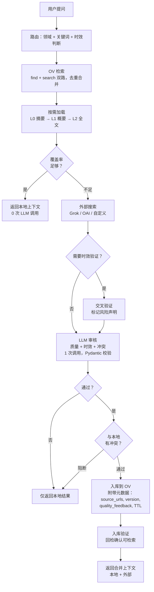

# OpenViking Curator

[English](README.md) / 中文

**[OpenViking](https://github.com/volcengine/OpenViking) 的知识治理插件。** Curator 管理你的知识库：判断本地知识够不够、要不要搜外部、审核搜回来的内容、把好的存进去。知识库随着每次提问自动成长。

[](LICENSE)
[](https://python.org)

## 工作流程



## Curator 做什么

Curator 是**治理层**——决定什么该进知识库、什么不该进。

| 功能 | 说明 | 文件 |
|------|------|------|
| **路由** | 规则判断：领域（技术/通用）、关键词提取、是否需要最新信息。无 LLM | `router.py` |
| **检索** | 双路：`find`（向量）+ `search`（LLM 意图）。按 URI 去重合并 | `retrieval_v2.py` |
| **按需加载** | L0（摘要 ~100 token）→ L1（概要 ~2k）→ L2（全文）。浅层够用就不往深了走，省 token | `retrieval_v2.py` |
| **覆盖率评估** | 看 OV 返回分数：top > 0.55 + 多条命中 = 够用，否则触发外搜 | `retrieval_v2.py` |
| **外部搜索** | 插件化。默认 Grok（实时网搜），也支持 OAI 兼容模型 | `search.py` + `search_providers.py` |
| **交叉验证** | 仅在 `need_fresh=true` 时执行。LLM 标记外搜结果中可能过时的声明 | `search.py` |
| **审核 + 冲突检测** | 一次 LLM 调用：打信任分（0-10）、判时效、pass/fail、检测与本地知识的矛盾。输出经 Pydantic 校验 | `review.py` |
| **冲突解决** | 可配策略：`auto`（信任分+时效自动判）、`local`、`external`、`human`。冲突可阻止入库 | `pipeline_v2.py` |
| **入库** | 审核通过的内容写回 OV，附带元数据：`source_urls`、`version`、`quality_feedback`、`freshness`、`ttl_days`、`review_after`。本地 `curated/` 也留备份 | `review.py` |
| **入库验证** | 入库后再搜一次 OV，确认新内容可被检索到 | `pipeline_v2.py` |
| **去重扫描** | 标题相似度对比（SequenceMatcher）。报告疑似重复——**不自动删除** | `dedup.py` |
| **时效评分** | 从 OV URI 提取时间戳，计算衰减分（新 → 旧） | `freshness.py` |
| **Session 追踪** | 记录哪些问题被问过、哪些 URI 被用了。提交 session 提取长期记忆 | `session_manager.py` |
| **查询日志** | 每次查询 → `data/query_log.jsonl`，含覆盖率、外搜原因、LLM 调用数 | `pipeline_v2.py` |
| **弱主题分析** | 聚类分析 query log，找出反复触发外搜的主题 = 知识空白 | `scripts/analyze_weak.py` |
| **主动补强** | 对 Top N 弱主题跑 pipeline，主动填补知识空白 | `scripts/strengthen.py` |
| **时效扫描** | 检查 URL 可达性 + TTL 是否过期。`--act` 自动刷新过期内容 | `scripts/freshness_scan.py` |

### Curator 不做什么

- **向量检索 / 索引** → OV（或你的后端）负责
- **生成回答** → 你的 LLM 负责；Curator 返回结构化上下文，不生成回答

## 快速开始

### 前置要求

- Python 3.10+
- OpenViking `ov.conf`（含 embedding + VLM 端点，[文档](https://github.com/volcengine/OpenViking)）
- 外搜 API key（推荐 Grok）+ LLM 审核 API key

### 安装

```bash
git clone https://github.com/ponsde/OpenViking_Curator.git
cd OpenViking_Curator
python3 -m venv .venv && source .venv/bin/activate
pip install -r requirements.txt

cp ov.conf.example ov.conf   # 填 embedding + VLM 端点
cp .env.example .env         # 填 API key
```

### 使用

```bash
# 健康检查
python3 curator_query.py --status

# 查询（外搜找到好内容会自动入库）
python3 curator_query.py "Docker 部署 Redis 怎么配置？"

# 审核模式（不自动入库，人工决定）
python3 curator_query.py --review "敏感话题"
```

### Docker

```bash
cp ov.conf.example ov.conf && cp .env.example .env
docker compose build
docker compose run --rm curator curator_query.py --status
docker compose run --rm curator curator_query.py "你的问题"
```

### MCP Server

```bash
python3 mcp_server.py   # stdio JSON-RPC，兼容 Claude Desktop / mcporter 等
```

工具：`curator_query`、`curator_ingest`、`curator_status`

### Python API

```python
from curator.pipeline_v2 import run

result = run("Nginx 反向代理 + SSL 怎么配？")
print(result["context_text"])         # 本地上下文
print(result["external_text"])        # 外搜补充（如有）
print(result["coverage"])             # 0.0 ~ 1.0
print(result["meta"]["ingested"])     # True = 有新内容入库
print(result["conflict"])             # 冲突检测结果
```

## 配置

全部通过 `.env`（已 git-ignore）：

### 必填

| 变量 | 说明 |
|------|------|
| `OPENVIKING_CONFIG_FILE` | `ov.conf` 路径 |
| `CURATOR_OAI_BASE` | OpenAI 兼容 API 地址（LLM 审核 + 路由）|
| `CURATOR_OAI_KEY` | API key |
| `CURATOR_GROK_KEY` | Grok key（默认搜索用 Grok，不用则不需要）|

### 可选

| 变量 | 默认值 | 说明 |
|------|--------|------|
| `OV_DATA_PATH` | `./data` | OV 数据目录 |
| `OV_BASE_URL` | _(空)_ | 设了就连远程 OV HTTP serve，否则嵌入模式 |
| `CURATOR_GROK_BASE` | `http://127.0.0.1:8000/v1` | Grok 端点 |
| `CURATOR_GROK_MODEL` | `grok-4-fast` | Grok 模型 |
| `CURATOR_SEARCH_PROVIDER` | `grok` | 搜索提供者：`grok` / `oai` / 自定义 |
| `CURATOR_LLM_ROUTE` | `1` | `1` = LLM 路由，`0` = 纯规则 |
| `CURATOR_VERSION` | `0.7.0` | 入库元数据版本标记 |
| `CURATOR_CHAT_RETRY_MAX` | `3` | chat API 重试次数（仅瞬时错误）|
| `CURATOR_CHAT_RETRY_BACKOFF_SEC` | `0.6` | 重试退避基数（秒）|
| `CURATOR_CONFLICT_STRATEGY` | `auto` | `auto` / `local` / `external` / `human` |

### 覆盖率阈值

| 变量 | 默认 | 作用 |
|------|------|------|
| `CURATOR_THRESHOLD_COV_SUFFICIENT` | `0.55` | 高于此值 = 不触发外搜 |
| `CURATOR_THRESHOLD_COV_MARGINAL` | `0.45` | 高于此值 = 边缘（仍会搜）|
| `CURATOR_THRESHOLD_COV_LOW` | `0.35` | 低于此值 = 一定搜 |
| `CURATOR_THRESHOLD_L0_SUFFICIENT` | `0.62` | L0 分数达到此值可跳过 L1 |
| `CURATOR_THRESHOLD_L1_SUFFICIENT` | `0.50` | L1 分数达到此值可跳过 L2 |

### 冲突解决策略

| 策略 | 行为 |
|------|------|
| `auto`（默认）| 信任 ≥ 7 + 最新 → 用外部。信任 ≤ 3 → 用本地。其他 → 人工审核 |
| `local` | 总是用本地 |
| `external` | 总是用外部 |
| `human` | 总是标记人工审核 |

## 入库元数据

每条入库内容都带可追溯的元数据：

| 字段 | 示例 | 用途 |
|------|------|------|
| `freshness` | `current` | 时效：`current` / `recent` / `unknown` / `outdated` |
| `ttl_days` | `180` | 基于时效的存活天数 |
| `ingested` | `2026-02-22` | 入库日期 |
| `review_after` | `2026-08-21` | 复查日期 |
| `version` | `0.7.0` | 入库时的 Curator 版本 |
| `source_urls` | `["https://..."]` | 去重后的来源 URL |
| `quality_feedback` | `{"judge_trust": 8, ...}` | 审核信号，为后续质量闭环准备 |

## 维护脚本

```bash
# 发现弱主题（知识空白）
python3 scripts/analyze_weak.py --top 10

# 主动补强
python3 scripts/strengthen.py --top 5

# 时效扫描
python3 scripts/freshness_scan.py --limit 50
python3 scripts/freshness_scan.py --ttl-scan          # TTL 过期检查
python3 scripts/freshness_scan.py --ttl-scan --act     # 自动刷新过期内容
```

## 项目结构

```
curator/
  backend.py           # KnowledgeBackend 抽象接口
  backend_ov.py        # OpenViking 实现（嵌入 + HTTP）
  backend_memory.py    # 内存后端（测试用）
  pipeline_v2.py       # 4 步管线主流程
  session_manager.py   # 双模式 OV 客户端
  retrieval_v2.py      # L0→L1→L2 加载 + 覆盖率 + 去重
  search.py            # 外搜 + 交叉验证
  review.py            # LLM 审核 + Pydantic 校验 + 入库 + 冲突
  router.py            # 规则路由
  config.py            # 配置 + 带重试的 chat
  freshness.py         # URI 时效评分
  dedup.py             # 重复资源扫描
  legacy/              # 归档的 v1 模块
curator_query.py       # CLI 入口
mcp_server.py          # MCP Server (stdio JSON-RPC)
search_providers.py    # 插件化搜索注册
scripts/               # 维护脚本：弱主题、补强、时效扫描
tests/                 # 单元测试
```

## 测试

```bash
python -m pytest tests/ -v
```

## Roadmap

- [x] KnowledgeBackend 抽象（可插拔存储）
- [x] 冲突检测 + 可配解决策略
- [x] 审核模式（`--review`）
- [x] 入库元数据（source_urls、version、quality_feedback）
- [x] chat 重试（仅瞬时错误）
- [x] Pydantic 校验审核输出
- [x] 弱主题分析 + 主动补强
- [x] 时效扫描 + TTL 管理
- [ ] 质量反馈闭环（feedback → 检索排序）
- [ ] 更多搜索提供者（DuckDuckGo、Tavily）
- [ ] 覆盖率自动调优（按命中率动态调阈值）
- [ ] 示例后端（Chroma、pgvector）

## License

[MIT](LICENSE)
