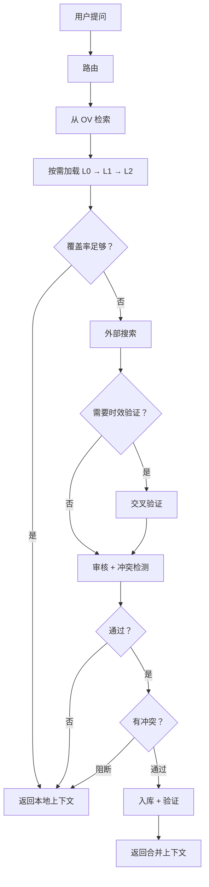

# OpenViking Curator

[English](README.md) / 中文

**[OpenViking](https://github.com/volcengine/OpenViking) 的知识治理插件。** Curator 管理你的 OV 知识库：判断本地知识够不够、要不要搜外部、审核搜回来的内容、把好的存进去。知识库随着每次提问自动成长。

[](https://github.com/ponsde/OpenViking_Curator/actions)
[](LICENSE)
[](https://python.org)

## 工作流程


```mermaid
flowchart TD
    Q[用户提问] --> R[路由]
    R --> OV[从 OV 检索]
    OV --> L[按需加载 L0 → L1 → L2]
    L --> COV{覆盖率足够？}
    COV -- 是 --> OUT1[返回本地上下文]
    COV -- 否 --> EXT[外部搜索]
    EXT --> F{需要时效验证？}
    F -- 是 --> CV[交叉验证]
    F -- 否 --> J
    CV --> J[审核 + 冲突检测]
    J --> P{通过？}
    P -- 否 --> OUT1
    P -- 是 --> C{有冲突？}
    C -- 阻断 --> OUT1
    C -- 通过 --> ING[入库 + 验证]
    ING --> OUT2[返回合并上下文]
```

**LLM 调用策略：**
- 覆盖率足够 → **0 次 LLM**，直接返回
- 触发外搜 → **1 次 LLM**（审核+冲突合并）
- 需要时效验证 → **2 次 LLM**（+交叉验证）

## 功能

| 功能 | 说明 | 模块 |
|------|------|------|
| **规则路由** | 领域、关键词、时效需求判断。无 LLM。支持 JSON 配置 | `router.py` |
| **双路检索** | `find`（向量）+ `search`（LLM 意图）。URI 去重 | `retrieval_v2.py` |
| **按需加载** | L0（摘要）→ L1（概要）→ L2（全文）。够用就不往深走 | `retrieval_v2.py` |
| **覆盖率评估** | score gap + 关键词重叠信号。0 次 LLM | `retrieval_v2.py` |
| **外部搜索** | 插件化 provider：Grok、DuckDuckGo、Tavily。Fallback 链或并发模式 | `search_providers.py` |
| **域名过滤** | 搜索结果白名单 / 黑名单 | `domain_filter.py` |
| **交叉验证** | `need_fresh=true` 时执行。标记风险声明 | `search.py` |
| **审核 + 冲突** | 一次 LLM 调用：信任分 0-10、时效、pass/fail、矛盾检测。Pydantic 校验 | `review.py` |
| **冲突解决** | 可配策略：`auto` / `local` / `external` / `human`。双向评分 | `pipeline_v2.py` |
| **入库** | 写回 OV 附元数据（来源 URL、版本、TTL、质量反馈） | `review.py` |
| **异步入库** | Fire-and-forget 后台线程。可通过异步任务追踪器观测 | `pipeline_v2.py` + `async_jobs.py` |
| **自动摘要** | 入库时自动生成 L0/L1 摘要 | `pipeline_v2.py` |
| **去重扫描** | URL 哈希（精确匹配）+ Jaccard 词集合相似度。只报告不删除 | `dedup.py` |
| **时效评分** | URI 时间戳 → 衰减分。可配阈值 | `freshness.py` |
| **Usage-based TTL** | 热/温/冷三档。高频使用 → 延长 TTL | `usage_ttl.py` |
| **反馈重排** | `up`/`down`/`adopt`。分数加权、rank 感知。OV 原始分仍主导 | `feedback_store.py` |
| **决策报告** | ASCII box / 单行 / JSON / HTML 导出。每次 `run()` 自带 | `decision_report.py` |
| **Session 追踪** | 记录查询 + 使用 URI。提交提取长期记忆 | `session_manager.py` |
| **查询日志** | 每次查询 → `query_log.jsonl`（覆盖率、原因、LLM 次数） | `pipeline_v2.py` |
| **熔断器** | 三态熔断包裹 LLM + 搜索调用。自动恢复 | `circuit_breaker.py` |
| **搜索缓存** | LRU + 双 TTL。文件锁持久化 | `search_cache.py` |
| **自动治理** | 周期性治理：审计、标记、主动外搜、生成报告。混合异步。不自动删除 | `governance.py` |
| **兴趣分析** | 从查询日志 + 反馈提取用户兴趣，生成主动搜索查询 | `interest_analyzer.py` |
| **后台调度** | APScheduler：定期时效扫描 + 弱主题补强 + 治理周期 | `scheduler.py` |
| **结构化日志** | structlog + JSON 模式。每次运行绑定 run_id、query 上下文 | `logging_setup.py` |

### Curator 不做什么

- **向量检索 / 索引** → OpenViking 负责
- **生成回答** → 你的 LLM 负责；Curator 返回结构化上下文，不生成答案

## 快速开始

### 前置要求

- Python 3.10+
- 已配好的 [OpenViking](https://github.com/volcengine/OpenViking)（嵌入模式或 HTTP 模式）
- OpenAI 兼容的 LLM API（审核用）
- 搜索 API（推荐 Grok，也可用 DuckDuckGo/Tavily）

### 安装

```bash
git clone https://github.com/ponsde/OpenViking_Curator.git
cd OpenViking_Curator

# 推荐：uv（快速、可复现）
uv sync
source .venv/bin/activate

# 或者：pip
python3 -m venv .venv && source .venv/bin/activate
pip install -r requirements.txt

cp .env.example .env   # 然后填入你的 key
```

### 配置

编辑 `.env`：

```bash
# OpenViking 配置（嵌入模式）
OPENVIKING_CONFIG_FILE=/path/to/your/ov.conf

# LLM（审核和路由，任何 OpenAI 兼容端点）
CURATOR_OAI_BASE=https://your-llm-api.com/v1
CURATOR_OAI_KEY=sk-your-key

# 外部搜索（推荐 Grok）
CURATOR_GROK_BASE=https://your-grok-endpoint/v1
CURATOR_GROK_KEY=your-grok-key
```

三个端点，三个 key，搞定。

### 使用

```bash
python3 curator_query.py --status                         # 健康检查
python3 curator_query.py "Docker 部署 Redis 怎么配？"      # 查询
python3 curator_query.py --review "敏感话题"               # 审核模式（不自动入库）
python3 mcp_server.py                                     # MCP 服务（stdio JSON-RPC）
```

### Docker

```bash
# 嵌入模式：OV 在容器内运行
cp ov.conf.example ov.conf   # 填入你的 embedding API key
cp .env.example .env         # 填入 LLM + 搜索 key
docker compose build
docker compose run --rm curator curator_query.py --status
docker compose run --rm curator curator_query.py "你的问题"

# HTTP 模式：OV 作为外部服务
cp ov.conf.example ov.conf   # 保持原样（HTTP 模式下不会读取）
echo "OV_BASE_URL=http://your-ov-host:8080" >> .env
docker compose build
docker compose run --rm curator curator_query.py --status
```

### Python API

```python
from curator.pipeline_v2 import run

result = run("Nginx 反向代理 + SSL 怎么配？")
print(result["context_text"])         # 本地上下文
print(result["external_text"])        # 外搜补充（如有）
print(result["coverage"])             # 0.0 ~ 1.0
print(result["meta"]["ingested"])     # True = 有新内容入库
print(result["conflict"])             # 冲突检测
print(result["decision_report"])      # ASCII 决策报告

# 复用 Pipeline 实例（共享 session + backend）
from curator.pipeline_v2 import CuratorPipeline
pipeline = CuratorPipeline()
r1 = pipeline.run("怎么部署？")
r2 = pipeline.run("什么是 RAG？")

# 决策报告其他格式
from curator.decision_report import format_report_json, format_report_html
print(format_report_json(result))
print(format_report_html(result))

# 反馈（影响下次检索排名）
from curator.feedback_store import apply
apply("viking://resources/doc-id", "up")    # 标记有用
apply("viking://resources/doc-id", "down")  # 标记无用
```

## 配置

全部通过 `.env`（已 git-ignore），详见 `.env.example`。

### 必填

| 变量 | 说明 |
|------|------|
| `OPENVIKING_CONFIG_FILE` | `ov.conf` 路径（嵌入模式）|
| `CURATOR_OAI_BASE` | OpenAI 兼容 API 地址 |
| `CURATOR_OAI_KEY` | API key |
| `CURATOR_GROK_KEY` | Grok key（外部搜索）|

### OV 模式

| 变量 | 默认 | 说明 |
|------|------|------|
| `OV_BASE_URL` | _(空)_ | 设置后用 HTTP 模式。空 = 嵌入模式 |
| `OV_DATA_PATH` | `./data` | OV 数据目录（嵌入模式）|

### 搜索

| 变量 | 默认 | 说明 |
|------|------|------|
| `CURATOR_SEARCH_PROVIDERS` | `grok` | 逗号分隔：`grok,duckduckgo,tavily`（按序 fallback）|
| `CURATOR_SEARCH_CONCURRENT` | `0` | `1` = 所有 provider 并发 |
| `CURATOR_SEARCH_TIMEOUT` | `60` | 搜索超时（秒）|
| `CURATOR_TAVILY_KEY` | _(空)_ | Tavily API key |
| `CURATOR_ALLOWED_DOMAINS` | _(空)_ | 白名单（逗号分隔）|
| `CURATOR_BLOCKED_DOMAINS` | _(空)_ | 黑名单（逗号分隔）|

### 阈值

| 变量 | 默认 | 作用 |
|------|------|------|
| `CURATOR_THRESHOLD_COV_SUFFICIENT` | `0.55` | 高于 = 不外搜 |
| `CURATOR_THRESHOLD_COV_MARGINAL` | `0.45` | 高于 = 边缘（仍搜）|
| `CURATOR_THRESHOLD_COV_LOW` | `0.35` | 低于 = 一定搜 |
| `CURATOR_THRESHOLD_L0_SUFFICIENT` | `0.62` | L0 足够 → 跳过 L1 |
| `CURATOR_THRESHOLD_L1_SUFFICIENT` | `0.50` | L1 足够 → 跳过 L2 |
| `CURATOR_MAX_L2_DEPTH` | `2` | 每次运行最大全文读取数 |

### 后台调度

| 变量 | 默认 | 说明 |
|------|------|------|
| `CURATOR_SCHEDULER_ENABLED` | `0` | `1` 启用后台任务 |
| `CURATOR_FRESHNESS_INTERVAL_HOURS` | `24` | 时效扫描间隔 |
| `CURATOR_STRENGTHEN_INTERVAL_HOURS` | `168` | 弱主题补强间隔（7 天）|
| `CURATOR_STRENGTHEN_TOP_N` | `3` | 每次补强的弱主题数 |

### 治理

| 变量 | 默认 | 说明 |
|------|------|------|
| `CURATOR_GOVERNANCE_ENABLED` | `0` | `1` 启用治理周期 |
| `CURATOR_GOVERNANCE_INTERVAL_HOURS` | `168` | 治理周期间隔（默认 7 天）|
| `CURATOR_GOVERNANCE_MODE` | `normal` | `normal` 或 `team`（team 模式含完整审计日志）|
| `CURATOR_GOVERNANCE_MAX_PROACTIVE` | `5` | 每周期最大主动搜索数 |
| `CURATOR_GOVERNANCE_SYNC_BUDGET` | `0` | 异步前同步执行数（0 = 全异步）|
| `CURATOR_GOVERNANCE_LOOKBACK_DAYS` | `30` | 查询日志分析回看天数 |
| `CURATOR_GOVERNANCE_DRY_RUN` | `0` | `1` 跳过写操作（仅审计）|
| `CURATOR_GOVERNANCE_REPLACES_STRENGTHEN` | `0` | `1` 治理启用时跳过独立补强任务 |

### 其他

| 变量 | 默认 | 说明 |
|------|------|------|
| `CURATOR_ASYNC_INGEST` | `0` | `1` = 后台异步入库 |
| `CURATOR_CONFLICT_STRATEGY` | `auto` | `auto` / `local` / `external` / `human` |
| `CURATOR_CB_ENABLED` | `1` | 熔断器（`0` 关闭）|
| `CURATOR_CACHE_ENABLED` | `0` | 搜索结果缓存 |
| `CURATOR_FEEDBACK_WEIGHT` | `0.10` | 反馈分数调整幅度 |
| `CURATOR_JSON_LOGGING` | `0` | `1` = JSON 结构化日志 |
| `CURATOR_CHAT_RETRY_MAX` | `3` | LLM 重试次数 |

## 维护

```bash
# 弱主题分析
python3 scripts/analyze_weak.py --top 10

# 主动补强
python3 scripts/strengthen.py --top 5

# 时效扫描
python3 scripts/freshness_scan.py --limit 50       # URL 可达性
python3 scripts/freshness_scan.py --act             # 自动刷新过期资源

# TTL 重平衡
python3 scripts/ttl_rebalance.py                    # 报告
python3 scripts/ttl_rebalance.py --json             # JSON 导出

# 异步任务管理
python3 scripts/async_job_cli.py list               # 概览
python3 scripts/async_job_cli.py list --failed      # 失败的任务
python3 scripts/async_job_cli.py replay <job_id>    # 重新执行

# 治理（自动化知识库维护）
python3 -m curator.governance_cli report             # 查看最新报告
python3 -m curator.governance_cli report --format json
python3 -m curator.governance_cli report --format html > report.html
python3 -m curator.governance_cli flags              # 待处理标记
python3 -m curator.governance_cli flags --all        # 所有标记
python3 -m curator.governance_cli show <flag_id>     # 标记详情
python3 -m curator.governance_cli keep <flag_id>     # 保留资源
python3 -m curator.governance_cli delete <flag_id>   # 批准删除
python3 -m curator.governance_cli adjust <flag_id>   # 需要调整
python3 -m curator.governance_cli ignore <flag_id>   # 忽略此标记
python3 -m curator.governance_cli run                # 触发完整治理周期
python3 -m curator.governance_cli run --dry          # 试运行（不写入）
python3 -m curator.governance_cli run --mode team    # Team 模式（完整审计）
```

也可以开启后台调度器（`CURATOR_SCHEDULER_ENABLED=1`），自动执行时效扫描和弱主题补强。加 `CURATOR_GOVERNANCE_ENABLED=1` 启用自动治理周期。

## 项目结构

```
curator/
  pipeline_v2.py       # 主管线编排器
  config.py            # 配置 + 带重试的 HTTP 客户端
  settings.py          # Pydantic Settings v2（类型安全、带校验）
  backend.py           # KnowledgeBackend 抽象接口
  backend_ov.py        # OpenViking 后端（嵌入 + HTTP）
  backend_memory.py    # 内存后端（测试用）
  session_manager.py   # 双模式 OV 客户端
  retrieval_v2.py      # L0→L1→L2 检索 + 覆盖率
  search.py            # 外搜 + 交叉验证
  search_providers.py  # 插件化 provider 注册
  review.py            # LLM 审核 + 入库 + 冲突
  router.py            # 规则路由（JSON 配置）
  freshness.py         # 时效评分
  usage_ttl.py         # Usage-based TTL 三档
  dedup.py             # 去重扫描
  decision_report.py   # ASCII / JSON / HTML 报告
  feedback_store.py    # up/down/adopt 反馈
  domain_filter.py     # 域名白名单/黑名单
  circuit_breaker.py   # 三态熔断器
  search_cache.py      # LRU + 双 TTL 缓存
  async_jobs.py        # 后台任务追踪
  governance.py        # 自动治理周期（6 阶段）
  governance_cli.py    # 治理 CLI（报告、标记、运行）
  governance_report.py # 治理报告（ASCII/JSON/HTML）
  interest_analyzer.py # 用户兴趣提取 + 主动搜索查询
  nlp_utils.py         # 主题提取 + 关键词工具
  scheduler.py         # APScheduler 定时任务
  logging_setup.py     # structlog 配置
  file_lock.py         # flock 工具
  legacy/              # 归档 v1
curator_query.py       # CLI 入口
mcp_server.py          # MCP Server（stdio JSON-RPC）
scripts/               # 维护脚本
tests/                 # 554 个测试
```

## 测试

```bash
# 全量测试（InMemoryBackend，无需 OV）
uv run pytest tests/ -v

# 单个文件
uv run pytest tests/test_core.py -v

# 类型检查
uv run mypy curator/ --ignore-missing-imports --exclude curator/legacy/
```

## 常见问题

| 问题 | 原因 | 解决 |
|------|------|------|
| `Missing required env vars` | `.env` 未配置 | 填 `CURATOR_OAI_BASE`、`CURATOR_OAI_KEY`、`CURATOR_GROK_KEY` |
| `OV 不可用` | OpenViking 不可达 | 检查 `OPENVIKING_CONFIG_FILE`（嵌入）或 `OV_BASE_URL`（HTTP）|
| `401 Unauthorized` | API key 错误 | 核实 `.env` 中的 key |
| 搜索超时 | 端点不通 | 检查端点 URL 和服务状态 |
| 覆盖率一直 0.0 | OV 是空的 | 先入库一些内容，或降低 `CURATOR_THRESHOLD_COV_SUFFICIENT` |
| 总是触发外搜 | 阈值太高 | 降低 `.env` 中的覆盖率阈值 |
| Judge 信任分低 | 模型太弱 | 换更强的模型到 `CURATOR_JUDGE_MODELS` |

## Roadmap

- [x] KnowledgeBackend 抽象（OV 无关接口）
- [x] 冲突检测 + 双向解决策略
- [x] Pydantic 校验的审核输出
- [x] 质量反馈闭环（feedback → 检索排名）
- [x] 去重增强（URL 哈希 + Jaccard）
- [x] 决策报告（ASCII + JSON + HTML）
- [x] 异步入库 + 任务追踪 + 恢复 CLI
- [x] 入库自动生成 L0/L1 摘要
- [x] 多 provider 搜索（Grok + DuckDuckGo + Tavily）
- [x] 域名过滤（白名单 / 黑名单）
- [x] Usage-based TTL（热/温/冷三档）
- [x] 熔断器 + 搜索缓存
- [x] 结构化日志（structlog + JSON 模式）
- [x] 后台调度（时效扫描 + 弱主题补强）
- [x] Docker 支持（嵌入 + HTTP 两种 OV 模式）
- [x] mypy + pre-commit（ruff + ruff-format）
- [x] uv 依赖管理
- [x] 自动治理（审计、标记、主动外搜、生成报告）
- [x] 基于兴趣的主动搜索（query log + 反馈分析）
- [x] 混合异步治理（sync budget + 后台线程 + trace 收割）
- [ ] 覆盖率自动调优（基于 query log 动态阈值）

## License

[MIT](LICENSE)
