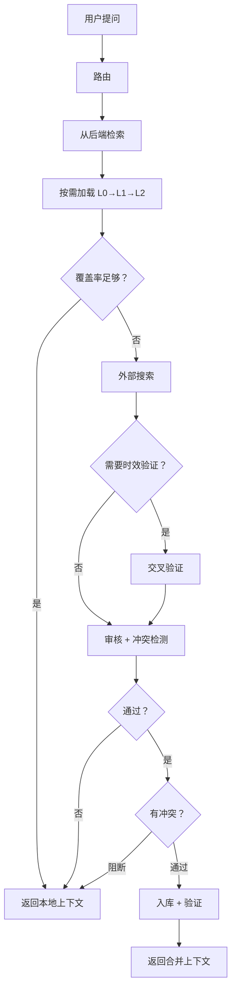

# OpenViking Curator

[English](README.md) / 中文

**[OpenViking](https://github.com/volcengine/OpenViking) 的知识治理插件。** Curator 管理你的知识库：判断本地知识够不够、要不要搜外部、审核搜回来的内容、把好的存进去。知识库随着每次提问自动成长。

[](LICENSE)
[](https://python.org)

## 工作流程



**LLM 调用策略：**
- 覆盖率足够 → **0 次 LLM**，直接返回
- 触发外搜 → **1 次 LLM**（审核+冲突合并）
- 需要时效验证 → **2 次 LLM**（+交叉验证）

## Curator 做什么

Curator 是**治理层**——决定什么该进知识库、什么不该进。

| 功能 | 说明 | 文件 |
|------|------|------|
| **路由** | 规则判断：领域、关键词、时效需求。无 LLM | `router.py` |
| **检索** | 双路：`find`（向量）+ `search`（LLM 意图）。按 URI 去重 | `retrieval_v2.py` |
| **按需加载** | L0（摘要）→ L1（概要）→ L2（全文）。浅层够用不往深走，省 token | `retrieval_v2.py` |
| **覆盖率评估** | 后端分数：top > 0.55 + 多条命中 = 够用，否则外搜 | `retrieval_v2.py` |
| **外部搜索** | 插件化。推荐 Grok（实时网搜），也支持任何 OAI 兼容端点 | `search.py` + `search_providers.py` |
| **交叉验证** | 仅 `need_fresh=true` 时执行。标记风险声明 | `search.py` |
| **审核 + 冲突** | 一次 LLM 调用：信任分 0-10、时效、pass/fail、矛盾检测。Pydantic 校验 | `review.py` |
| **冲突解决** | 可配：`auto` / `local` / `external` / `human`。冲突可阻止入库 | `pipeline_v2.py` |
| **入库** | 写回后端附元数据：`source_urls`、`version`、`quality_feedback`、TTL。本地备份 | `review.py` |
| **入库验证** | 入库后再搜确认可检索 | `pipeline_v2.py` |
| **去重扫描** | 标题相似度对比。报告疑似重复——不自动删除 | `dedup.py` |
| **时效评分** | URI 时间戳 → 衰减分 | `freshness.py` |
| **Session 追踪** | 记录查询 + 使用的 URI。提交提取长期记忆 | `session_manager.py` |
| **查询日志** | 每次查询 → `data/query_log.jsonl` | `pipeline_v2.py` |
| **弱主题分析** | 聚类 query log 找知识空白 | `scripts/analyze_weak.py` |
| **主动补强** | 对弱主题跑 pipeline 填补空白 | `scripts/strengthen.py` |
| **时效扫描** | URL 可达性 + TTL 过期。`--act` 自动刷新 | `scripts/freshness_scan.py` |

### Curator 不做什么

- **向量检索 / 索引** → 你的后端负责
- **生成回答** → 你的 LLM 负责；Curator 返回结构化上下文

## 快速开始

### 前置要求

- Python 3.10+
- 知识库后端（默认 OpenViking，任何 `KnowledgeBackend` 实现都行）
- OpenAI 兼容的 LLM API（审核/路由用）
- 外部搜索 API（推荐 Grok，也可用其他 OAI 兼容模型）

### 安装

```bash
git clone https://github.com/ponsde/OpenViking_Curator.git
cd OpenViking_Curator
python3 -m venv .venv && source .venv/bin/activate
pip install -r requirements.txt

cp .env.example .env         # 填入你的 API 端点和 key
```

如果用 OpenViking 做后端：
```bash
cp ov.conf.example ov.conf   # 填 embedding + VLM 端点
```

### 使用

```bash
python3 curator_query.py --status                         # 健康检查
python3 curator_query.py "Docker 部署 Redis 怎么配？"      # 查询
python3 curator_query.py --review "敏感话题"               # 审核模式
```

### 常见错误

| 错误 | 原因 | 解决 |
|------|------|------|
| `Missing required env vars` | `.env` 未配置 | 复制 `.env.example` 并填写 |
| `OV 不可用` | 后端不可达 | 检查配置路径和后端状态 |
| `401 Unauthorized` | API key 错误 | 核实 `.env` 中的 key |
| `timeout` | 搜索端点不通 | 检查端点 URL 和服务状态 |
| `Non-JSON response` | API 返回了 HTML | URL 应以 `/v1` 结尾 |

### Docker

```bash
cp .env.example .env
docker compose build
docker compose run --rm curator curator_query.py --status
```

### MCP Server

```bash
python3 mcp_server.py   # stdio JSON-RPC，兼容 Claude Desktop / mcporter
```

### Python API

```python
from curator.pipeline_v2 import run

result = run("Nginx 反向代理 + SSL 怎么配？")
print(result["context_text"])         # 本地上下文
print(result["external_text"])        # 外搜补充
print(result["coverage"])             # 0.0 ~ 1.0
print(result["meta"]["ingested"])     # True = 有新内容入库
print(result["conflict"])             # 冲突检测结果
```

## 配置

全部通过 `.env`（已 git-ignore），详见 `.env.example`。

### 必填

| 变量 | 说明 |
|------|------|
| `CURATOR_OAI_BASE` | OpenAI 兼容 API 地址（LLM 审核/路由）|
| `CURATOR_OAI_KEY` | API key |

外部搜索用 Grok（推荐）：

| 变量 | 说明 |
|------|------|
| `CURATOR_GROK_BASE` | Grok API 端点 |
| `CURATOR_GROK_KEY` | Grok API key |

OpenViking 做后端时：

| 变量 | 说明 |
|------|------|
| `OPENVIKING_CONFIG_FILE` | `ov.conf` 路径 |

### 可选

| 变量 | 默认 | 说明 |
|------|------|------|
| `OV_DATA_PATH` | `./data` | 后端数据目录 |
| `OV_BASE_URL` | _(空)_ | 远程 OV HTTP（空 = 嵌入模式）|
| `CURATOR_GROK_MODEL` | `grok-4-fast` | Grok 搜索模型 |
| `CURATOR_JUDGE_MODELS` | _(配置默认)_ | 审核模型（逗号分隔 fallback）|
| `CURATOR_ROUTER_MODELS` | _(配置默认)_ | 路由模型 |
| `CURATOR_SEARCH_PROVIDER` | `grok` | `grok` / `oai` / 自定义 |
| `CURATOR_VERSION` | `0.7.0` | 入库元数据版本 |
| `CURATOR_CHAT_RETRY_MAX` | `3` | 重试次数（仅瞬时错误）|
| `CURATOR_CONFLICT_STRATEGY` | `auto` | 冲突策略 |

### 覆盖率阈值

| 变量 | 默认 | 作用 |
|------|------|------|
| `CURATOR_THRESHOLD_COV_SUFFICIENT` | `0.55` | 高于 = 不外搜 |
| `CURATOR_THRESHOLD_COV_MARGINAL` | `0.45` | 高于 = 边缘（仍搜）|
| `CURATOR_THRESHOLD_COV_LOW` | `0.35` | 低于 = 一定搜 |

### 冲突解决

| 策略 | 行为 |
|------|------|
| `auto`（默认）| 信任≥7+最新→外部。信任≤3→本地。其他→人工 |
| `local` | 总是用本地 |
| `external` | 总是用外部 |
| `human` | 总是人工审核 |

## 入库元数据

| 字段 | 示例 | 用途 |
|------|------|------|
| `freshness` | `current` | 时效级别 |
| `ttl_days` | `180` | current=180, recent=90, unknown=60, outdated=0 |
| `ingested` | `2026-02-22` | 入库日期 |
| `review_after` | `2026-08-21` | 复查日期 |
| `version` | `0.7.0` | Curator 版本 |
| `source_urls` | `["https://..."]` | 来源 URL |
| `quality_feedback` | `{"judge_trust": 8}` | 审核信号 |

## 维护脚本

```bash
python3 scripts/analyze_weak.py --top 10          # 弱主题分析
python3 scripts/strengthen.py --top 5             # 主动补强
python3 scripts/freshness_scan.py --ttl-scan      # TTL 过期检查
python3 scripts/freshness_scan.py --ttl-scan --act # 自动刷新
```

## 项目结构

```
curator/
  backend.py           # KnowledgeBackend 抽象接口
  backend_ov.py        # OpenViking 实现
  backend_memory.py    # 内存后端（测试）
  pipeline_v2.py       # 4 步管线
  session_manager.py   # 双模式 OV 客户端
  retrieval_v2.py      # L0→L1→L2 + 覆盖率 + 去重
  search.py            # 外搜 + 交叉验证
  review.py            # 审核 + 入库 + 冲突
  router.py            # 规则路由
  config.py            # 配置 + 带重试的 chat
  freshness.py         # 时效评分
  dedup.py             # 重复扫描
curator_query.py       # CLI 入口
mcp_server.py          # MCP Server
search_providers.py    # 搜索注册
scripts/               # 维护脚本
tests/                 # 测试
```

## 测试

```bash
python -m pytest tests/ -v
```

## Roadmap

- [x] KnowledgeBackend 抽象
- [x] 冲突检测 + 可配策略
- [x] 审核模式（`--review`）
- [x] 入库元数据
- [x] chat 重试
- [x] Pydantic 校验
- [x] 弱主题分析 + 补强
- [x] 时效扫描 + TTL
- [ ] 质量反馈闭环
- [ ] 去重增强（URL 哈希 + embedding）
- [ ] 异步入库
- [ ] 入库自动生成 L0/L1 摘要
- [ ] Decision Report
- [ ] 更多搜索提供者
- [ ] 覆盖率自动调优
- [ ] Usage-based TTL

## License

[MIT](LICENSE)
